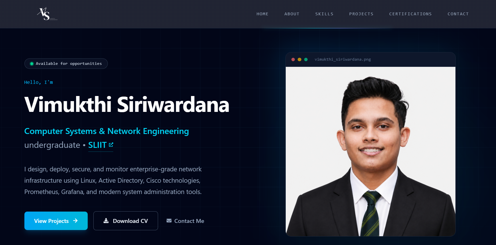

# 🌐 Personal Portfolio Website


A modern, responsive, and professional personal portfolio website built to showcase my technical skills, enterprise projects, home labs, certifications, and professional journey as a **Computer Systems & Network Engineering undergraduate**.

---

## 🌐 Live Demo

🔗 **Portfolio Website**

https://vimukthi-siriwardana.vercel.app

---

## 📸 Preview



---

## 📖 About

This portfolio serves as a central platform to showcase my:

- 👨‍💻 Technical Skills
- 🌐 Enterprise & Academic Projects
- 🧪 Home Lab Projects
- 📜 Professional Certifications
- ☁️ Cloud & Infrastructure Experience
- 📊 Monitoring & Observability Projects
- 📬 Contact Information

Designed with a clean, modern, and responsive interface, the website focuses on performance, accessibility, and user experience while presenting my technical work in a professional way.

---

## 🛠️ Built With

- React
- Vite
- Tailwind CSS
- JavaScript (ES6+)
- React Icons
- EmailJS

---

## 💡 Technologies

- React
- Vite
- Tailwind CSS
- JavaScript
- HTML5
- CSS3
- Git
- GitHub
- Vercel
- React Icons
- EmailJS

---

## ✨ Features

- 📱 Fully Responsive Design
- 🎨 Modern & Professional User Interface
- ⚡ Fast Performance with Vite
- ✨ Animated Hero Section
- 🛠️ Interactive Technical Skills Section
- 📂 Enterprise & Academic Project Showcase
- 🧪 Home Lab Showcase
- 📜 Professional Certifications
- 📧 Contact Form Integration
- 🔄 Smooth Scrolling Navigation
- 🌙 Clean Dark Theme

---

## 📂 Project Structure

```text
src/
│
├── assets/
├── components/
├── constants/
├── data/
├── sections/
├── App.jsx
└── main.jsx
```

---

## ⚙️ Installation

Clone the repository:

```bash
git clone https://github.com/VimukthiSiriwardana/personal-portfolio.git
```

Navigate to the project directory:

```bash
cd personal-portfolio
```

Install dependencies:

```bash
npm install
```

Start the development server:

```bash
npm run dev
```

Build for production:

```bash
npm run build
```

Preview the production build:

```bash
npm run preview
```

---

## 📬 Contact

**Vimukthi Siriwardana**

📧 **Email**  
vimukthi.induwara2004@gmail.com

💼 **LinkedIn**  
https://www.linkedin.com/in/vimukthi-siriwardana

🌐 **Portfolio**  
https://vimukthi-siriwardana.vercel.app

---

## 📄 License

This project is licensed under the **MIT License**.

---

⭐ If you found this project interesting, consider giving it a star on GitHub.